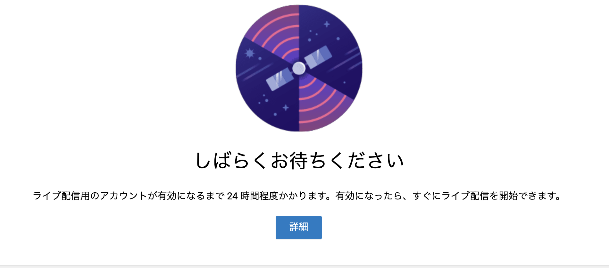
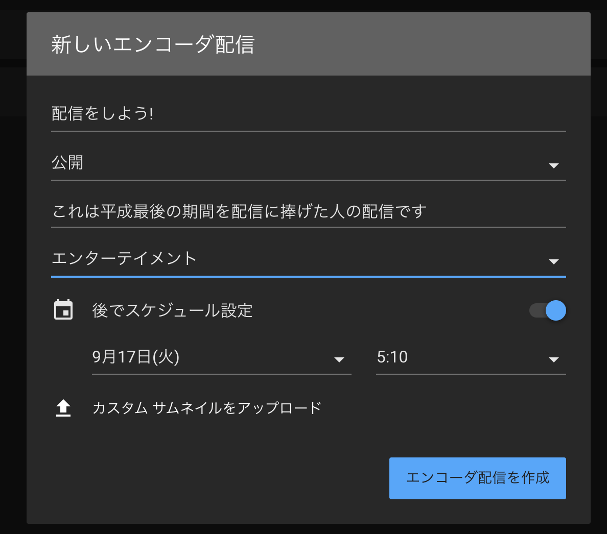
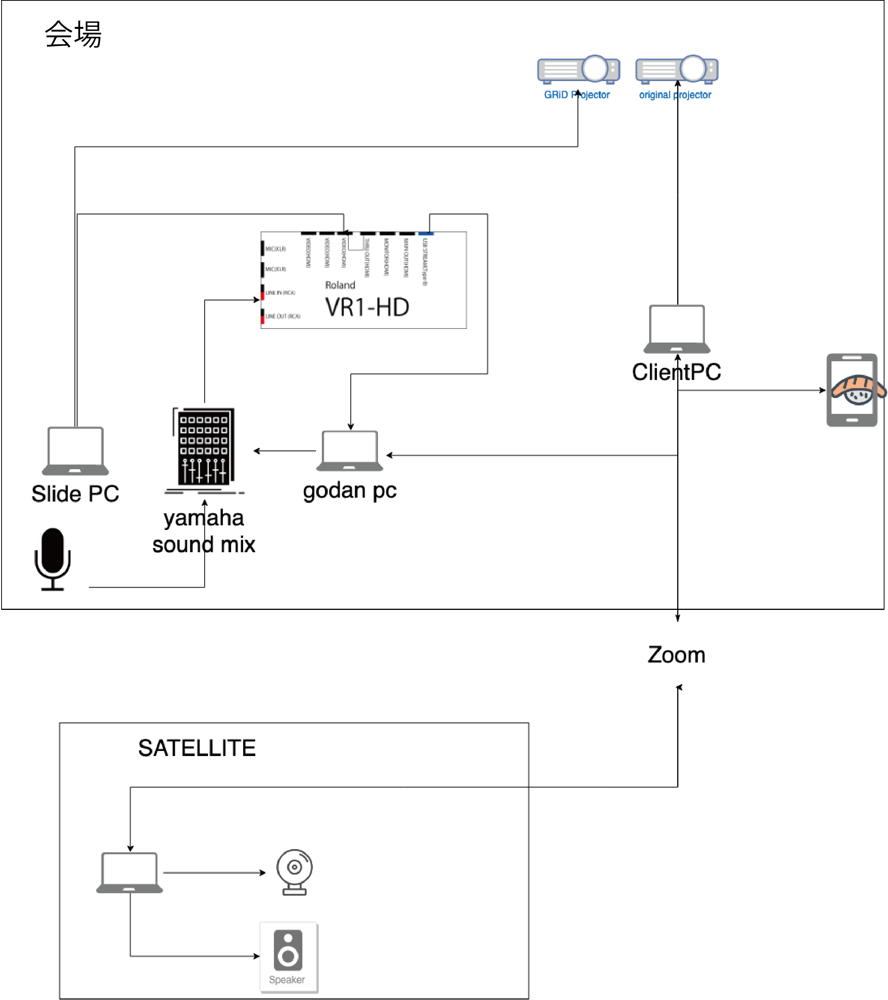
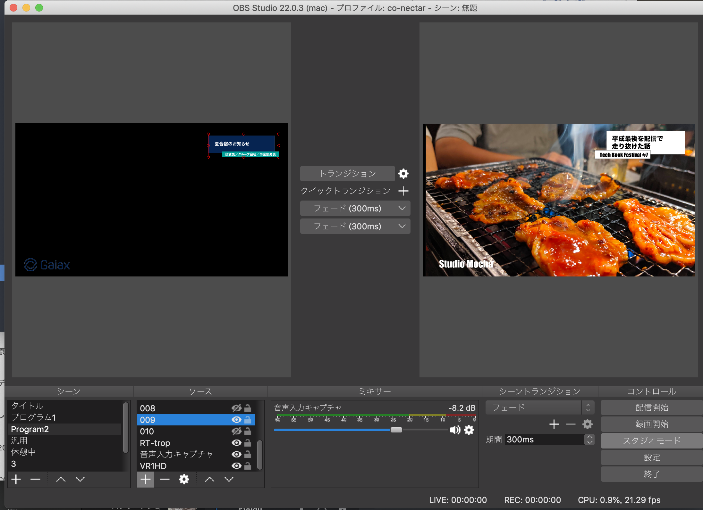

# 第2章 配信を始めよう

要件定義が出来たらそれに合わせて準備をしていきましょう!  
ここではカメラ2台+パソコン画面でのYoutubeLive配信を例に筆者がイベント主催者から依頼をもらってから当日までに行っていることをまとめていきます。

## 当日までのスケジュール
まずは当日までのスケジュールを引いていきましょう。  

下に一例として2台+パソコンスライドの配信時のスケジュールをお見せします。
| 何日前 | 内容 |成果物|
| --- | --- | -- |
| 2週間前 | 配信依頼 |  |
|   ↓ |  配信の内容を聞いて配信形式をまとめる |  | 
| ↓ | 配信に必要な情報をもらう | イベント詳細情報|
| 一週間前 | 配信機材の配置図を書く | 配置図 |
|  ↓ | テロップを作って先方のチェックをお願いする | テロップ素材 | 
| ↓ | タイムラインをまとめる |  タイムライン | 
| 前日 | 資料印刷しておく |  紙出力された資料 |
| ↓ | 機材の準備をしておく| 心の余裕 |

### 配信アカウントを用意する

当たり前だと思うかもしれませんが事前に用意が必要です。  
プラットフォームによっては即座に配信可能だったりしますが、今回例に上げるYoutube Liveは配信するために事前に申請をして最大48時間待つ必要があります。
申請には電話番号を使ったSMS認証か電話による認証を行います。
SMSの場合は一つの電話番号で年間登録できるのは2つまでという制限がありますが、電話による認証には上限がありません。

### 配信枠を用意する

配信の申請が通ったら配信枠を用意します。  
もちろん当日に用意をしてもいですが、事前にイベント配信のURLを生成しておくと告知などがスムーズになります。  
右上のメニューから`新しいライブ配信`をクリックして新しいライブを作成します。
 

タイトルやスケジュルールを入れて配信を作成しましょう。

### 配置図を書く

配信の形式が決まって、使う機材が極まれば配置図を書きましょう。配置図を書く目的は次の点です。  

- 各器材をどのようにつなげるのか図式化する
- 会場にどのようにカメラを設置するのか

とくに音にかんしては複雑になりがちです。  
次は著者が実際に使った配置図です。配置図を書くツールはパワーポイントでもAdobe Illustratorでも構いませんがオススメはDrow.ioです。  
画像検索窓で`mic`や`cam`で検索するといい感じのアイコンを用意してくれます。また矢印なども引きやすくそれに対してコメントもできるのでお手軽に配置図を書くことが出来ます。

### タイムラインを引く

ここまで来たらタイムラインを引きましょう。  
カメラ1台でずっと流すだけでいい場合は特に用意する必要はありませんが、イベントの進行度合いに寄ってテロップを入れ替えたり、休憩があるイベントでは良い都度のテロップを使うのかが記載されたタイムラインを引いておきましょう。  

### 注意事項を伝える

- 配信に顔が映る可能性があることを参加者に通知する
- 登壇者に配信の許可と資料がネット上に配信されることへの同意を取る
- BGMや映像の著作権の問題を伝える

これが案外漏れがちな部分だと思います。著者の過去のやらかしだと次のことがありました。

- パソコンの資料の中に映画のワンシーンが入っていた
- イベント主催者にはお伝えしたがそこから登壇者に伝わっていなかった

小さなイベントで大きな問題にはならないと思いますが、会社名などが入っていればそれは会社の名前を負っていることと同義です。著者などには細線の注意を払いましょう。

### テロップを作る

テロップはあるだけで"配信感"を非常に引き立ててくれる要素です。  
また視聴者に今はどのイベントでどの演目が行われているのかを伝える非常に大事な情報です。  

著者はAdobe Illustratorで作成していますが、なければパワーポイントなどを組み合わせて作ることも可能です。  
作る際は次の点を気にしながら作ると良いでしょう。

- 背景の映像や資料とお色かぶりしづらいものを選ぶ
- フォントはみやすさ優先
- 要素は3つまでに抑えて短く伝える

 基本的にはイベント名+今映っている物の説明を書きだすと良いでしょう。

### OBSで配信の用意をしよう

近年では配信ソフトも様々な物が出て来てますが、無料で使うならOBSでしょう。OBSはLinux, Mac OS, Windowsで動く配信オーサリングソフトです。  

