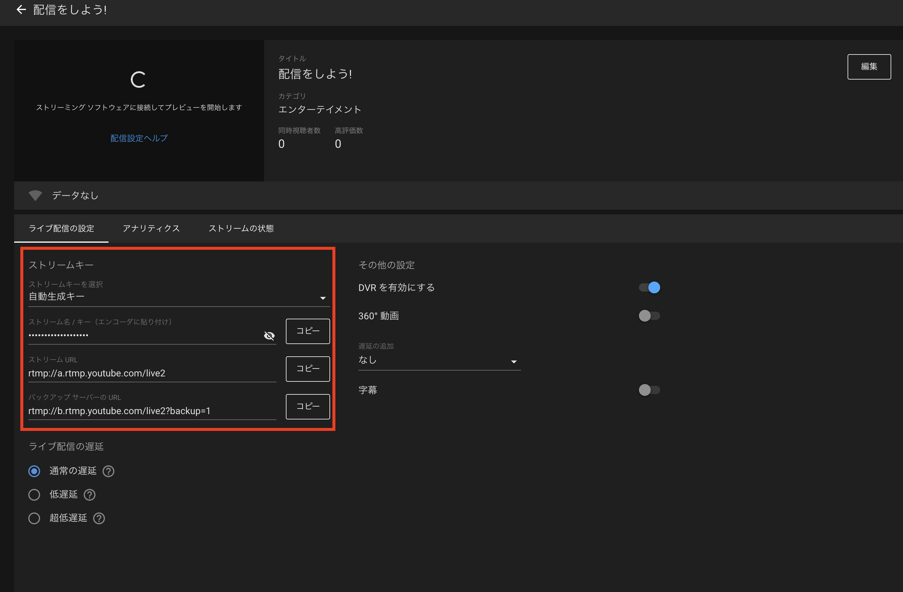
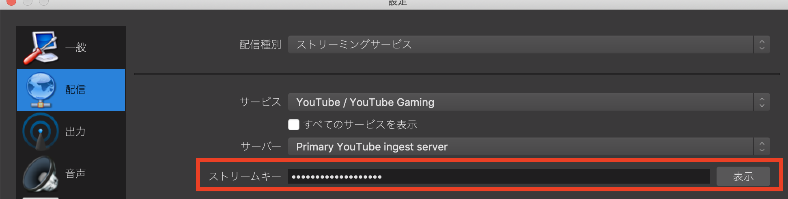

# 設営をしよう

さぁいよいよ当日です。  
まずは設営をしていきましょう。  

## 設営をしよう

最初は色々と慣れないでしょうが数を重ねていくとスムーズにできるようになると思います。  
著者は次の手順で準備することが多いです。

1. カメラを用意する
2. ビデオスイッチャーなど機材の設置する
3. カメラやパソコンとビデオスイッチャーをむすぶ
4. 音響卓とビデオスイッチャーをつなげる
5. 接続がただしいか確認する
6. ケーブルの固定や保護用のゴムマットを敷く
7. 配信先サービスへの接続確認する

ビデオスイッチャー単体では接続ができてるかわからないので先に入力するカメラを用意してからビデオスイッチャーを用意して指しています。このタイミングでモニターなどを用意してビデオスイッチャーまで映像の信号が来ていることを確認します。  
次に音響卓からビデオスイッチャーに接続して音が正しく入っているか確認します。  
このときマイクの音量チェックもしておくと後々が楽になったりします。  

## OBSの設定をする

次にOBSからYoutubeLiveへの配信をするための設定をします。
YoutubeLiveの管理ダッシュボードでストリームキーを手に入れます。  


それをOBSの`設定`→`配信`でストリームキーを転載。  


これでOBSの設定は完了です。  
OBSでは予め配信開始を押しておきましょう。
事前にYoutubeへ映像を送って配信ダッシュボードで映像が正しく来ているかプレビューすることができます。


## 打ち合わせ

イベント開始前にイベント主催や担当の人間と最終確認のための打ち合わせをします。このとき確認すべきはことは次のことです。

- イベント配信を開始するタイミングはどこか?
- イベント配信を終了させるタイミングはどこか?
- パソコンを繋いでる場合はパソコンとの接続確認

## 配信開始!

さぁ時間になればいよいよ配信開始です!  
YoutubeLiveの管理画面から`配信開始`を押します。  
イベントによるとは思いますが、著者は配信開始時には次の様なコメントを打つようにしています。

```
本日は[イベント名]をご視聴いただきありがとうございます。  
配信担当者です。
快適な配信を心がけますが配信中にネットワークや機材トラブルによって配信が乱れるまたは中断する可能性が有りますご了承ください。
イベント配信中の要望やご意見等ご気軽にコメントしていただけると幸です。
```


### 配信中気をつけること

配信中は適切にスイッチしながら配信をしていくことになりますが、画面の切り替えのタイミングはかなり感なでやっています…  
基本的には話している人をバストアップで写し、資料を使っているときはPinPで写しています。資料に人が重なる場合は適宜資料のみにしています。また同じ資料で説明しているときは途中から人を写したりしています。  
基本的には自分が見ていて見やすいかを心がけると良いです。  

PCで配信している場合はPCで内蔵カメラを塞いでおくことをおすすめします。  OBSで設定していなければ切り替わることはまずないのですが、過去著者が遭遇した事例だですと、ビデオスイッチャーとの接続が切れて内蔵カメラに切り替わっていまい自分の顔がインターネット配信されてしまうという事件がありました。  
Amazonで検索すると内蔵カメラを塞ぐ道具も販売されていますが、塞ぐだけなのでマスキングテープや、養生テープなどでも構いません。


### 配信でミスをしたら

いくら念入りに準備していてもミスやトラブルはつきものです。  
ここでは著者が過去に遭遇したトラブルを上げておきます。

- 配信の途中にビデオスイッチャーの電源が落ちて内蔵カメラに切り替わる
- ビデオスイッチャーとPCをつなぐケーブルの規格が古く転送速度が足らずに映像がブロックノイズまみれになる
- 音響卓からマイクの音声が拾えずYoutubeLiveのコメントで「会話が聞き取れない」とクレームで死にそうになる
- ネットワークが途中で瞬断が発生して配信ができなくなる

いくら準備しても上記のようなことは起きてしまいます。そのときに心が死なないためにもできることをしておきましょう。  
まずは、各カメラは必ずSDカードなどに録画しておきましょう。録画して有ればイベント終了後に公開するという手段を取ることができます。  
また容量に余裕が有ればあわせてOBSの録画機能も使いましょう。OBSの録画機能であればテロップなども合わせて録画できます。  
主催者と事前にトラブルがある可能性を共有しておきましょう。そしてその場合は後追いでの公開をする旨などを共有しておくと起きたとしても慌てずに対応することができます。  
